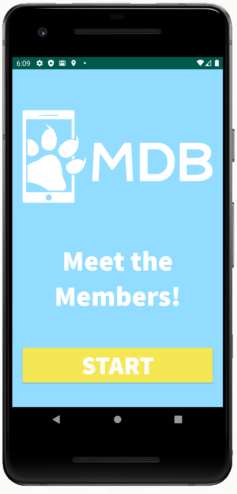
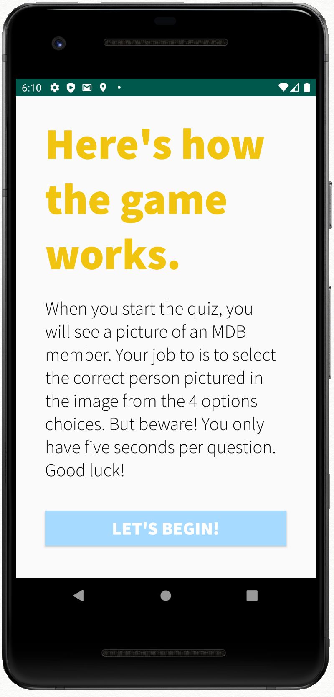
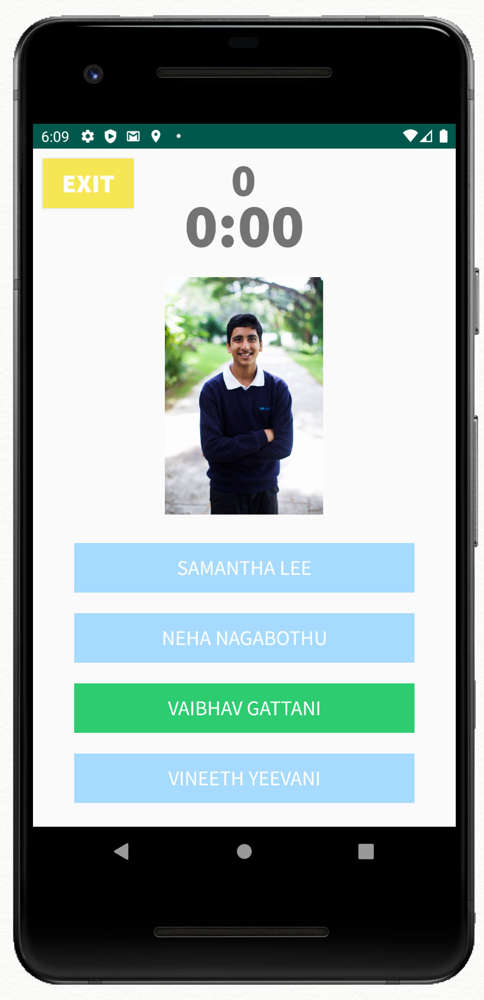
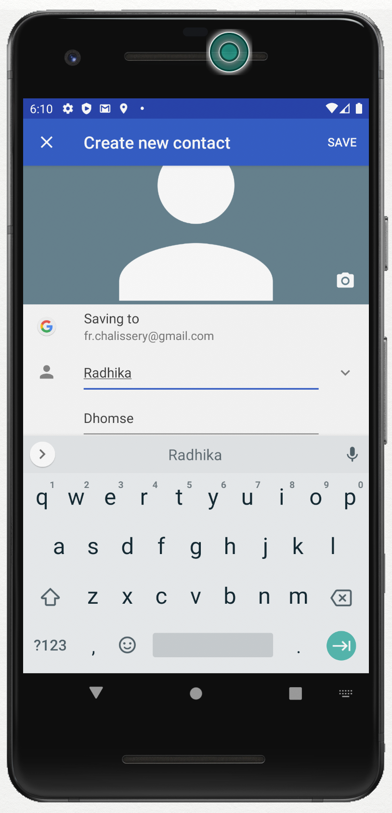

# Meet the Members!
This app is a game designed to introduce someone to all the faces and names of MDB members! The app starts on a starting screen, then goes to the instruction screen, and then the game screen. In the game, the player has 5 seconds to correctly match the picture of the member with one of the four correct name options. If the user selected correctly, that option will light up as green. Otherwise, that option will light up as red and the correct answer will do so in green. Cool functionality: if the player clicks on the member's picture in the game, they will be directed to the Contacts app where that member's name is preloaded.

     

 
<i>The starting screen that a player sees.</i>
    

 
<i>The app then conveys the instructions of the game to the player.</i>
    

 
<i>The game displays an image of an MDB—the player then has to match that picture with one of the four name options.</i>
    

 
<i>The game displays an image of an MDB—the player then has to match that picture with one of the four name options.</i>
    

